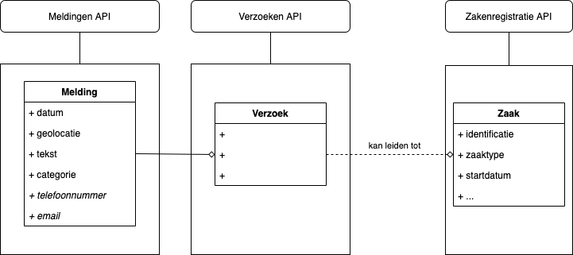
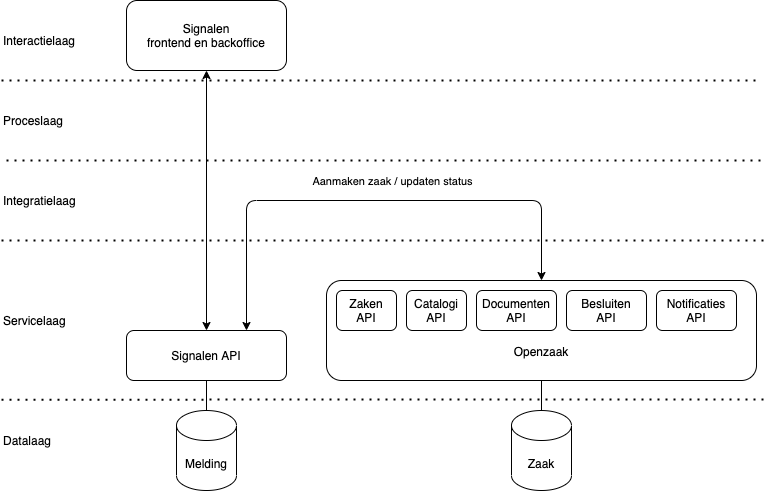

# De relatie tussen Signalen en Zaakgericht werken (ZGW)

Zaakgericht werken is een concept dat veel gebruikt wordt in gemeenten, maar kent in de praktijk veel vormen en implementatievarianten. VNG werkt met [GEMMA](https://www.gemmaonline.nl/index.php/ZGW_in_GEMMA_2) aan het richtinggeven en standaardiseren van Zaakgericht werken, onder andere door het opstellen van [API specificaties](https://vng-realisatie.github.io/gemma-zaken/).

Signalen is een proces- en taaksysteem voor het melden en afhandelen van meldingen openbare ruimte (MOR) dat inwoners in staat stelt om eenvoudig en anoniem meldingen te doen. Signalen volgt de [principes van Common Ground](https://appstore.commonground.nl/20190130_-_Common_Ground_-_Realisatieprincipes.pdf) waarbij onder andere verantwoordelijkheden worden gescheiden in lagen en componenten. Signalen biedt bijvoorbeeld een service waardoor eenvoudig gekoppeld kan worden met andere systemen.

Gemeente Amsterdam heeft Signalen gekoppeld aan verschillende taakafhandelsystemen voor onder andere handhaving en beheer van verlichting. Meldingen worden bij binnenkomst door een behandeld medewerker beoordeeld en (afhankelijk van de categorie) eventueel doorgestuurd naar een gespecialiseerd taakafhandelsysteem. Meldingen die doorgezet zijn worden vervolgens afgehandeld in het gespecialiseerde taakafhandelsysteem.

Sinds begin dit jaar is de software van Signalen geschikt gemaakt voor andere gemeenten. Ook gemeenten die zaakgericht werken uitgebreid hebben ingebed in hun organisatie tonen interesse in de functionaliteit van Signalen en willen de oplossing in combinatie met zaakgericht werken gebruiken. In dit document gaan we in op de verhouding tussen Signalen en Zaakgericht werken (ZGW) en hoe deze twee gecombineerd kunnen worden.

## Het verschil tussen een Melding en een Zaak

In [Zaakgericht Werken in het Gemeentelijk Gegevenslandschap](https://www.gemmaonline.nl/images/gemmaonline/f/fa/20190206_-_Zaakgericht_werken_in_het_Gemeentelijk_Gegevenslandschap.pdf) (4.1) wordt er onderscheid gemaakt tussen een Melding / Verzoek en een Zaak. Hierbij is een Verzoek een generieke naam voor een Melding. Een melding wordt gedaan door een burger en kan - afhankelijk van de aard van de melding - opgewaardeerd worden tot een zaak wanneer de melding verdere behandeling behoeft. Hierbij is het belangrijk om te vermelden dat één verzoek kan leiden tot meerdere zaken, maar ook dat meerdere verzoeken kunnen leiden tot één zaak. Bijvoorbeeld meerdere meldingen openbare ruimte over een kapotte straatlantaarn kunnen met één zaak afgehandeld worden. Er is dus geen strikte één-op-één relatie.

Voor Verzoeken en Zaken zijn er verschillende registraties onderkend. Ook is er ruimte voor een losse registratie voor een Melding, waarbij melding-specifieke gegevens in de Meldingenregistratie worden bijgehouden.

## Een casus met Signalen en Openzaak

Als we het ontwerp van VNG voor Zaakgericht werken toepassen op een specifieke implementatie met Signalen en Openzaak zien we hoe de twee samen kunnen werken.

1. Een inwoner doet een melding via de Signalen frontend.
1. Een medewerker beoordeelt de binnengekomen melding in de Signalen backoffice en handelt meldingen direct in de backoffice af waar geen behandeling voor nodig is.
1. Voor een melding die niet direct afgehandeld kan worden worden één of meerdere zaken aangemaakt in Openzaak onder het gewenste zaaktype.
1. Een medewerker met een (gespecialiseerde) taakapplicatie handelt vervolgens de zaak af via Openzaak.
1. De status van de afgehandelde zaak wordt automatisch via een notificatie teruggekoppeld aan Signalen. Op het moment dat alle onderliggende zaken in Openzaak zijn afgehandeld wordt een Melding in Signalen automatisch gesloten.

## Referenties

- Gebaseerd op https://github.com/MarcelMoerman/Zaak-Document-Services
